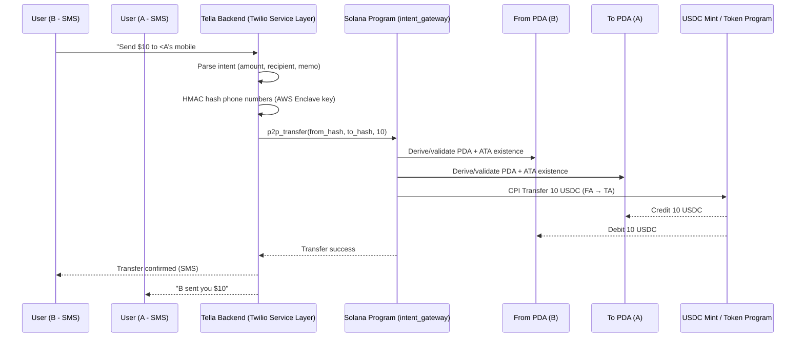
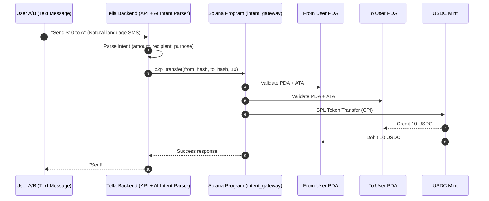

# intent-gateway

Solana-based `program` to facilitate **intent-driven transactions**.

This version implements **txt2pay** — P2P payments via text messages.

### No Apps. No Wallet. No Friction
**Text/type → see your money moving.**

From the history of computing machines, PCs became mainstream when Apple **successfully shed its nerdy image** for everyday users.  
This broke the entry barrier and flattened the learning curve.

### References
- [Smithsonian: Forty years ago the Mac triggered a revolution](https://www.smithsonianmag.com/innovation/forty-years-ago-the-mac-triggered-a-revolution-in-user-experience-180983623/)
- [CNN: iMac G3 25th anniversary](https://www.cnn.com/style/apple-imac-g3-25th-anniversary)
- [Wired: iMacs spell death to beige boxes](https://www.wired.com/1999/01/imacs-spell-death-to-beige-boxes/)
- [ZDNet: How iMac reshaped the PC industry](https://www.zdnet.com/article/how-imac-reshaped-the-pc-industry/)
- [Global Business Outlook: iMac at 25](https://globalbusinessoutlook.com/magazine/technology-magazine/imac-at-25-a-lasting-influence/)

The same problem exists for the **internet of blockchains**.  
Complex, nerdy wallet setups make **general, everyday, non-crypto users** nervous.  

With **intent-gateway**, money movement is as simple as sending a text message — `in natural SMS lingo`.

---

### Core Concepts
- **No crypto UX friction** — users interact using SMS, no wallet apps required
- **Custodial onboarding** — wallets created automatically if needed
- **Identity abstraction** — user identifiers are SHA-256 phone hashes
- **Security** — PDA-based authority, ATA validation, CPI transfer
- **Immutable ledger** — funds move on Solana via USDC program

### Program Design

The `intent_gateway` Solana program powers intent-driven payments executed purely through SMS.  
User accounts are represented as PDAs derived from hashed phone numbers, and funds move through validated ATAs owned by these PDAs. Transfers are performed using SPL token CPI calls.

### Workflow

#### High-Level Human Flow (SMS Experience)
```
A → B: Hey, I’m low on money. Can you spot me 10 bucks?
B → A: Sure.
B → Tella: Send $10 to <A’s mobile number>

Tella → B: Confirm transfer of $10 to A? (via phone call + PIN entry)
B enters PIN over call
Tella → B: Sent $10 to <A's mobile number>
```

#### Wallet handling (automated)
```
If wallet exists for B (sender)
    Proceed with transfer

If wallet does NOT exist for B
    Tella → B: Link your bank to fund wallet (Plaid link)
    B → Tella: Done
    Tella → B: Calling for PIN setup 

If wallet exists for A (recipient)
    Tella → A: B sent you $10

If wallet does NOT exist for A
    Tella → A: B sent you $10 — connect wallet with your bank (Plaid link)
```

#### Technical Flow (System-Level Sequence)


### Security

- **PDA signer seeds** — Program Derived Addresses ensure transfer authority cannot be owned or forged by any external user or key. Only the program itself can authorize actions via `invoke_signed`, preventing unauthorized invocation or spoofed signers.  
- **ATA validation** — Verifies that token accounts are derived from the correct owner and mint before performing transfers.  
- **No self-transfer rule** — Prevents circular or exploitative self-sending.  
- **Tella-only invocation** — Enforces that only the backend service (Tella) can call program instructions.  
- **Encrypted hashed phone numbers** — User phone numbers are never stored in plaintext. An HMAC key stored in a secure AWS enclave generates irreversible hashes, protecting user privacy even in breach scenarios.

---



[Tella](https://github.com/jungledesh/tella) — the backend service that acts as the brain of `intent-gateway`.


### Architecture

#### Following are some assumptions / requirements for this to work

- Users have a mobile phone
- User have a working mobile phone number
- Users have a bank account, that they can use to fund their on-chain accounts

#### USDC Cmds

1. Create an ATA

``` 
spl-token create-account Gh9ZwEmdLJ8DscKNTkTqPbNwLNNBjuSzaG9Vp2KGtKJr \ 
  --owner hXLSiJmGbX7Npd2z3a699wPSBQWkZt44Q6v2F2v1uqz \
  --fee-payer ~/.config/solana/id.json \
  --url https://api.devnet.solana.com
```

2. Check balance
```
spl-token balance --address <ATA-Address>
```

3. Transfer USDC
```
spl-token transfer Gh9ZwEmdLJ8DscKNTkTqPbNwLNNBjuSzaG9Vp2KGtKJr 5 \                         
  <recipient-ATA-Address> \
  --fund-recipient \
  --url https://api.devnet.solana.com 
```
This transfers local wallet's ATA USDC to recipient's ATA

4. Fund local wallet USDC 
```
Visit Faucet: https://spl-token-faucet.com/?token-name=USDC-Dev
```

Connect Wallet, and selct Devnet both in Wallet and Faucet Page

Copy and Paste Wallet's Address (i.e. Public key) to fund USDC. 
Tokens go automatically to the ATA linked to account
 

Note: Tella right now uses Singh's local solana key pair as the only authZ'd pair to call & sign tx
