# Intent-Gateway

[](https://github.com/jungledesh/intent_gateway/blob/main/LICENSE)
[](https://solana.com/)
[](https://www.rust-lang.org/)
[](https://www.anchor-lang.com/)

Intent Gateway is a Solana program built with Anchor that serves as the on-chain component for intent-driven transactions.

It abstracts user wallet management by automatically initializing Program Derived Addresses (PDAs) and Associated Token Accounts (ATAs), and facilitates secure peer-to-peer (P2P) USDC transfers.

This program is designed to enable seamless, intent-based interactions (e.g., via SMS in the companion [Tella](https://github.com/jungledesh/tella) service layer), removing the need for users to manage wallets or keys directly.

## No Apps. No Wallet. No Friction
**text/type → see your money moving.**

From the history of computing machines, PCs became mainstream when Apple **successfully shed its nerdy image** for everyday users.  
This broke the entry barrier and flattened the learning curve.

### References
- [Smithsonian: Forty years ago the Mac triggered a revolution](https://www.smithsonianmag.com/innovation/forty-years-ago-the-mac-triggered-a-revolution-in-user-experience-180983623/)
- [CNN: iMac G3 25th anniversary](https://www.cnn.com/style/apple-imac-g3-25th-anniversary)
- [Wired: iMacs spell death to beige boxes](https://www.wired.com/1999/01/imacs-spell-death-to-beige-boxes/)
- [ZDNet: How iMac reshaped the PC industry](https://www.zdnet.com/article/how-imac-reshaped-the-pc-industry/)
- [Global Business Outlook: iMac at 25](https://globalbusinessoutlook.com/magazine/technology-magazine/imac-at-25-a-lasting-influence/)

The same problem exists for the **internet of blockchains**.  
Complex, nerdy wallet setups make **general, everyday, non-crypto users** nervous.  

With **intent-gateway**, money movement is as simple as sending a text message — `in natural SMS lingo`.

## Overview

The core idea is to provide a secure, custodial on-chain gateway for intents parsed from off-chain sources (like natural language SMS). Users are identified via hashed IDs (e.g., SHA-256 of phone numbers), and the program ensures only authorized callers (e.g., the backend service) can invoke instructions. This setup supports applications like "txt2pay" - P2P payments triggered by text messages while maintaining Solana's speed and low costs.

## Core Concepts
- **No crypto UX friction** — users interact using SMS, no wallet apps required
- **Custodial onboarding** — wallets created automatically if needed
- **Identity abstraction** — user identifiers are SHA-256 phone hashes
- **Security** — PDA-based authority, ATA validation, CPI transfer
- **Immutable ledger** — funds move on Solana via USDC program

## Workflow

### High-Level Human Flow (SMS Experience)
```
A → B: Hey, I’m low on money. Can you spot me 10 bucks?
B → A: Sure.
B → Tella: Send $10 to <A’s mobile number>

Tella → B: Confirm transfer of $10 to A? (via phone call + PIN entry)
B enters PIN over call
Tella → B: Sent $10 to <A's mobile number>
```

### Wallet handling (automated)
```
If wallet exists for B (sender)
    Proceed with transfer

If wallet does NOT exist for B
    Tella → B: Link your bank to fund wallet (Plaid link)
    B → Tella: Done
    Tella → B: Calling for PIN setup 

If wallet exists for A (recipient)
    Tella → A: B sent you $10

If wallet does NOT exist for A
    Tella → A: B sent you $10 — connect wallet with your bank (Plaid link)
```

### Technical Flow (System-Level Sequence)

```mermaid
sequenceDiagram
    participant U as User (B - SMS)
    participant TAU as User (A - SMS)
    participant T as Tella Backend (Twilio Registered Service Layer)
    participant P as Solana Program (intent_gateway)
    participant FA as From PDA (B)
    participant TA as To PDA (A)
    participant USDC as USDC Mint / Token Program

    U->>T: "Send 10 bucks to <A's-mobile-number>"
    T->>T: Parse intent (amount, recipient, memo)
    T->>T: HMAC hash phone numbers (if not already onboarded)
    T->>U: "Confirm tx via PIN on ph"
    T->>P: p2p_transfer(from_hash, to_hash, 10) (post-pin verification)

    P->>FA: Derive/validate PDA + ATA existence
    P->>TA: Derive/validate PDA + ATA existence
    P->>USDC: CPI Transfer 10 USDC (FA → TA)

    USDC-->>TA: Credit 10 USDC
    USDC-->>FA: Debit 10 USDC
    P-->>T: Transfer success

    T-->>U: Transfer confirmed
    T-->>TAU: "B sent you $10"
```


## Security

- **PDA signer seeds** — Program Derived Addresses ensure transfer authority cannot be owned or forged by any external user or key. Only the program itself can authorize actions via `invoke_signed`, preventing unauthorized invocation or spoofed signers.  
- **ATA validation** — Verifies that token accounts are derived from the correct owner and mint before performing transfers.  
- **No self-transfer rule** — Prevents circular or exploitative self-sending.  
- **[Tella-only](https://github.com/jungledesh/tella) invocation** — Enforces that only the backend service (Tella) can call program instructions.  
- **Encrypted hashed phone numbers** — User phone numbers are never stored in plaintext. An HMAC key stored in a secure AWS enclave generates irreversible hashes, protecting user privacy even in breach scenarios.

## Accounts & PDAs

The program uses Program Derived Addresses (PDAs) to represent users on-chain.
Each user’s wallet authority is derived from a SHA-256 HMAC hash of their phone number:

```
user_pda = Pubkey::find_program_address(
    [b"user", phone_hash],
    program_id
)
```

### Account Model

| Account                      | Description                        | Created When                         | Notes                               |
| ---------------------------- | ---------------------------------- | ------------------------------------ | ----------------------------------- |
| **User PDA**                 | Custodial authority for user funds | First interaction (init or transfer) | Owned by program, not user keypairs |
| **ATA (USDC)**               | SPL Token ATA for user             | Auto-created if missing              | Validated before transfers          |
| **System Program**           | Solana native program              | —                                    | Required for PDA allocation         |
| **Token Program**            | SPL Program for USDC               | —                                    | Handles CPI transfer                |
| **Associated Token Program** | Creates ATAs                       | —                                    | Convenience program                 |
| **USDC Mint**                | Mint address of token              | Static                               | Used for balance validation         |

### PDA Guarantees

+ No end-user private keys involved → removes UX friction

+ PDAs cannot sign arbitrarily — only program via invoke_signed

+ Prevents spoofing forged wallets or redirecting transfers

## Instruction Reference

`initialize_user`

```
initialize_user(ctx, user_id_hash)
```
| Arg          | Type       | Purpose                  |
| ------------ | ---------- | ------------------------ |
| `user_id_hash` | `[u8; 32]` | HMAC-hashed phone number |

Creates PDA + ATA if not already present.

`p2p_transfer`

```
p2p_transfer(ctx, from_user_id_hash, to_user_id_hash, amount)
```

| Arg                 | Type       | Purpose              |
| ------------------- | ---------- | -------------------- |
| `from_user_id_hash`         | `[u8; 32]` | Sender phone hash    |
| `to_user_id_hash`           | `[u8; 32]` | Recipient phone hash |
| `amount`            | `u64`      | Amount in USDC       |

### Validations

+ Sender & recipient PDAs derived and verified

+ ATAs validated against PDA authority and USDC mint

+ ATA auto-create for missing accounts

+ Reject self-transfer

+ Reject transfer amount less than 0

+ CPI executed transfer

## Installation

### Prerequisites

Ensure the following are installed:

| Tool                   | Version                    |
| ---------------------- | -------------------------- |
| **Rust**               | `1.80+`                    |
| **Solana CLI**         | `1.18+`                    |
| **Anchor**             | `0.30+`                    |
| **Node + Yarn / pnpm** | *(optional for scripting)* |
| **jq**                 | for JSON inspection        |

### Install Solana & Anchor

```
sh -c "$(curl -sSfL https://release.solana.com/v2.1.3/install)"
cargo install --git https://github.com/coral-xyz/anchor avm --locked
avm install latest
avm use latest
```

### Verfiy Setup

```
solana --version
anchor --version
rustc --version
```

### Clone the Repository

```
git clone https://github.com/jungledesh/intent-gateway.git
cd intent-gateway
```

### Install dependencies:

```
cargo build
anchor build
```

## Deployment 

### Generate program keypair (first time only)

```
solana-keygen new -o keys/intent_gateway-keypair.json
```

### Build and Deploy script 

```
#!/bin/bash

echo "🧹 Cleaning cargo ..."
cargo clean

echo "🧹 Cleaning anchor ..."
anchor clean

echo "📁 Recreating deploy directory..."
mkdir -p target/deploy

echo "🔁 Restoring program keypair..."
cp keys/intent_gateway-keypair.json target/deploy/intent_gateway-keypair.json

# ✅ Delete old IDL (important)
rm -f target/idl/intent_gateway.json

echo "🔨 Building..."
RUSTFLAGS="-C link-arg=-v" anchor build

# Check: does this file now contain p2pTransfer?
cat target/idl/intent_gateway.json | jq '.instructions[].name'

echo "🚀 Deploying to $1..."
RUSTFLAGS="-C link-arg=-v" anchor deploy --provider.cluster $1

echo "🧪 Running tests ..."
RUSTFLAGS="-C link-arg=-v" anchor test --provider.cluster $1
```

### Run Deployment 

Supported cluster values

| Cluster  | Arg                 |
| -------- | ------------------- |
| Localnet | `localnet`          |
| Devnet   | `devnet`            |
| Testnet  | `testnet`           |
| Mainnet  | `mainnet`           |

Example: 
```
chmod +x scripts/deploy.sh
./deploy.sh devnet
```

## Useful Commands

1. Create an ATA (Associated Token Account for USDC)

``` 
spl-token create-account Gh9ZwEmdLJ8DscKNTkTqPbNwLNNBjuSzaG9Vp2KGtKJr \
  --owner <address-of-the-owner> \
  --fee-payer ~/.config/solana/id.json \
  --url https://api.devnet.solana.com
```

2. Check ATA balance and other info
```
spl-token account-info --address <ata-address> --url https://api.devnet.solana.com
```

3. Transfer Tokens (USDC)
```
spl-token transfer Gh9ZwEmdLJ8DscKNTkTqPbNwLNNBjuSzaG9Vp2KGtKJr 5 \
  <recipient-ATA-Address> \
  --fund-recipient \
  --url https://api.devnet.solana.com
```
This transfers local wallet's ATA USDC to recipient's ATA

4. View deployed program ID

```
solana address -k keys/intent_gateway-keypair.json
```

5. View IDL definition

```
cat target/idl/intent_gateway.json | jq
```

## Fund local wallet with USDC (Devnet)

+ Open [Devnet Faucet](https://spl-token-faucet.com/?token-name=USDC-Dev)
+ Connect Wallet
+ Ensure devnet selected (both wallet + faucet UI)
+ Paste your wallet public key
+ Faucet will airdrop directly into your USDC ATA (creates if it does not exist)

## Testing

+ Unit tests in `tests/intent-gateway.ts` cover initialization, trasnfers, and error cases. 

+ Run with `anchor test --provider.cluster devnet` for devnet testing

+ Coverage: Aim for 90%+; use cargo tarpaulin for reports.

## Related Projects

[Tella](https://github.com/jungledesh/tella): The off-chain service layer for intent parsing and SMS integration.

For questions, open an issue. Built for a future where intents drive on-chain actions seamlessly!

## License

This project is licensed under the MIT License - see the [LICENSE](LICENSE) file for details.